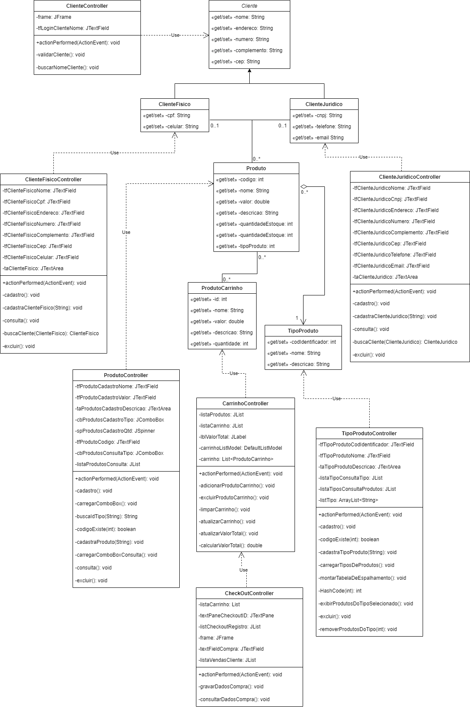

# Trabalho Semestral ED - Sistema de Backoffice
Trabalho Semestral para a matéria de Estrutura de Dados da Fatec ZL.

# Equipe
-[Gustavo da Silva Ignácio](https://github.com/gustavoign)

-[Heloísa Santana da Silva](https://github.com/heloisasantana)

-[Kailaine Almeida de Souza](https://github.com/Kay-Almeida)

-[Matheus Augusto Marti](https://github.com/Matheus-Marti1)

# Diagrama de Classes

